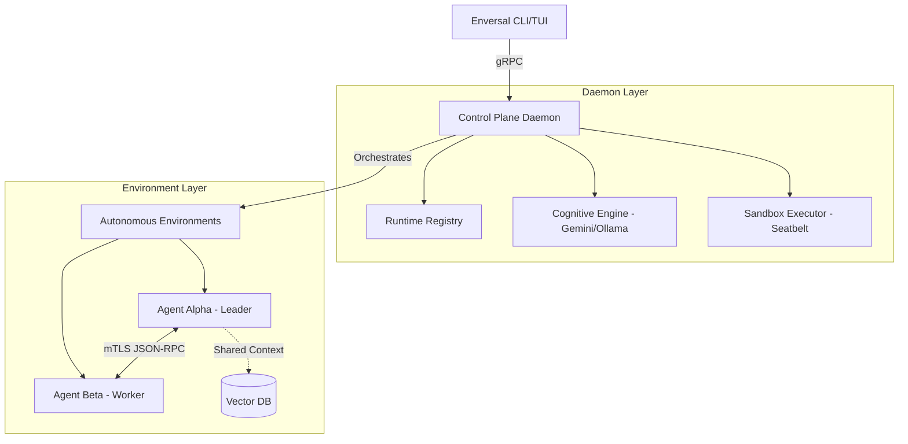

# Enversal: Universal Environments for AI Agents

**Enversal** is a system that helps you build secure, highly controlled environments for both real and simulated AI agents. It provides an isolated, collaborative "universe" where agents can operate with physical, OS-level constraints to ensure host safety.

## 🚀 Key Concepts

Enversal is built around three core environmental abstractions:

| Concept | Description |
| :--- | :--- |
| **Isolone** | A strictly isolated sandbox for a single agent. No network or external access by default. Ideal for untrusted tool execution. |
| **Commune** | A shared, collaborative environment where multiple agents work toward a common goal, featuring leader election and shared context. |
| **Wormhole** | An inter-environment gateway allowing temporary data trading and resource bidding between distinct Communes or Isolones. |

## 🛡️ Zero-Trust Security (The Seatbelt Engine)

Unlike traditional orchestrators, Enversal presumes that AI Agents are unpredictable. It utilizes native OS security primitives to enforce constraints:

- **macOS (Seatbelt):** Dynamically generated Scheme profiles for kernel-level process jails.
- **Linux (Landlock & seccomp):** Granular file-system and syscall filtering.
- **Resource Quotas:** Hard limits on CPU, RAM, and network egress per agent.

## 🏗️ Architecture Overview



## 📂 Project Structure

Enversal is a high-performance Rust workspace:

- `core`: Pure data models and manifest parsing (`enversal.yaml`).
- `brain`: The AI reasoning interface (mapping to Gemini/local LLMs).
- `sandbox`: Kernel-level execution abstractions and security policy engines.
- `daemon`: The `tokio`-based gRPC Control Plane and lifecycle orchestrator.
- `cli`: Terminal gateway for deploying and inspecting universes.

## 🛠️ Quick Start

### 1. Prerequisites
- **Rust** (Stable)
- **macOS** (for Seatbelt support) or **Linux** (for Landlock support)

### 2. Launch the Control Plane
Start the background daemon to listen for gRPC requests:
```bash
cargo run --bin enversal-daemon
```

### 3. Deploy an Environment
Use the CLI to spin up a universe from a blueprint:
```bash
cargo run --bin enversal-cli -- run blueprints/example_commune.yaml
```

## 📖 Documentation

For deep technical details, refer to the `docs/` folder:
- [Technical Architecture](docs/enversal_architecture.md)
- [Project Specification](docs/enversal_spec.md)

---
Developed by [Kenmburu](https://github.com/rubum) | Built with Rust 🦀
